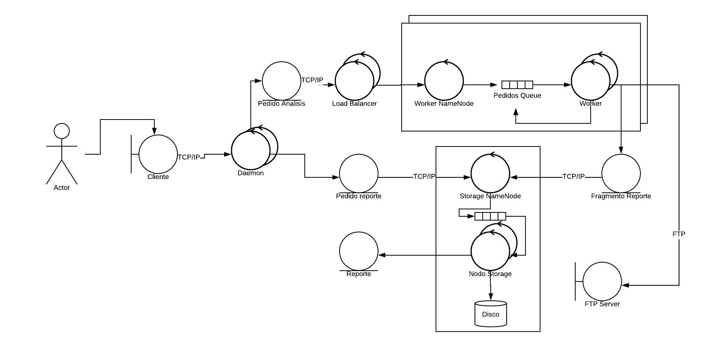
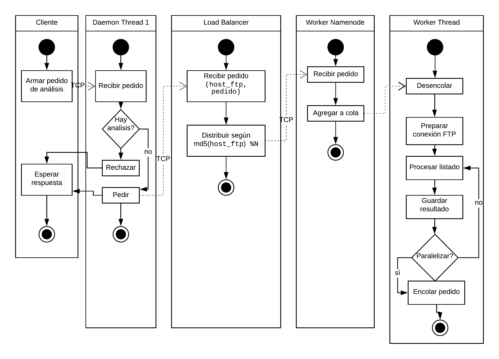
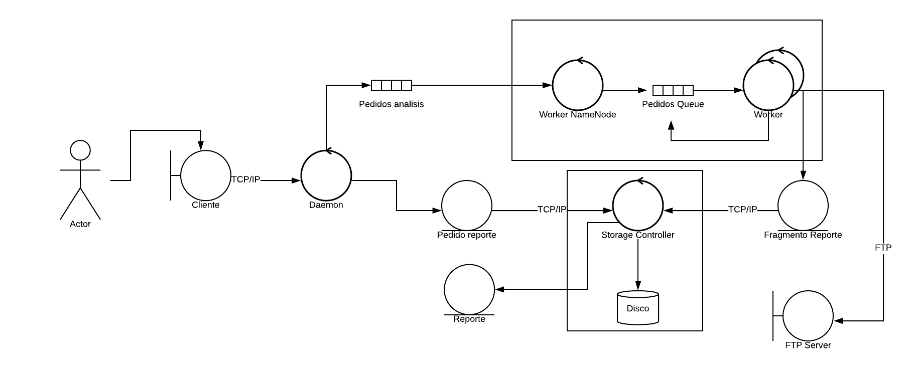
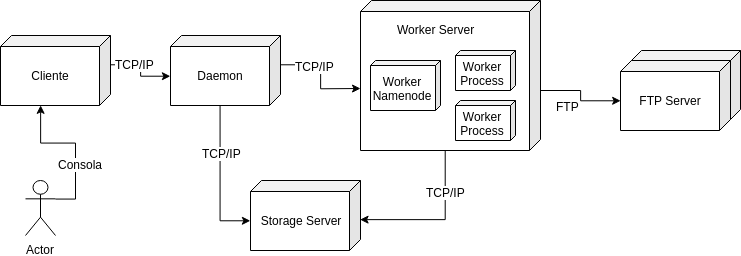

## Arquitectura general

La propuesta completa de arquitectura se puede ver en el Apéndice 1 como
forma de diagrama de robustez o en el Apéndice 2 como un diagrama de
actividades.

Elaboremos, entonces, los puntos claves que debe resolver la propuesta de
arquitectura. Estos son:

* debe haber un servicio corriendo todo el tiempo al cual se le pueda
consultar resultados y hacer nuevos pedidos
* escalabilidad de la arquitectura, en varios puntos:
 + manejos de muchas consultas de clientes al servicio
 + muchos análisis corriendo al mismo tiempo a servidores remotos
 + muchos datos a almacenar
* la utilización de varias computadoras para escalar debe ser
transparente y no debería requerir cambios en el código (ej. solo
por configuración)
* persistencia de los resultados
* debe proponer una solución *fair* que maneje el *trade-off* entre procesar pedidos nuevos y avanzar con los que ya están en proceso
* si bien se debe paralelizar el análisis del servidor FTP, no hay que
agotar los recursos del servidor (cantidad de conexiones y pedidos
simultáneos)

La propuesta de arquitectura paraleliza el servicio de consultas al cliente
(Daemon) con varios hilos, por lo que puede atender un buen volumen de consultas
tanto de análisis como de resultados. Por otro lado, se plantea un grupo
de procesadores que son paralelizables y puestos detrás de un Load
Balancer. La idea de éste último se puede ver en el diagrama de actividades
del Apéndice 2: para dividir los pedidos entre varios de estos grupos
se puede usar una regla sencilla basada en la IP que se plantea analizar. Otras
formas de balanceo pueden basarse en latencia, cantidad de
*hops* o *throughput* de la red que conecta al grupo con el servidor FTP. Además
de este balanceo entre grupos, cada uno tiene varios hilos de procesamiento
que reciben pedidos a través de una cola.

Por otro lado, se desacopla totalmente el manejo de la estructura de datos,
ya que corresponde a otro grupo (o contenedor) que gestiona las complejidades
de actualización de la estructura (por su naturaleza recursiva) y la
persistencia de la misma. De la misma manera que el contenedor de procesadores,
existe un *name node* que toma los pedidos y los pone en una cola para
ser procesados. La cola puede ser la misma o puede ser particionada en varias
para permitir la distribución de los datos en varios sistemas de archivos
distintos.

Estas consideraciones en el diagrama de robustez resuelven la mayoría de los
puntos indicados al principio de la sección. Los restantes, sobre el *fairness*
de la solución y la disponibilidad de recursos de los servidores remotos, se
pueden observar en el diagrama de actividades. En el hilo del Worker hay una pregunta
fundamental cuando se termina de procesar un listado: si se puede paralelizar. Las
respuestas implícitas a estas preguntas son tres: la positiva, la negativa por
superpoblación de pedidos de ese servidor y la negativa por la abundancia de conexiones
al servidor remoto. Por eso, también hay una cola interna que puede navegar el hilo
para aprovechar la conexión establecida. El balanceo es entonces entre la cantidad
de threads que procesan al mismo tiempo y la cantidad de cosas que hace cada thread
(anchura vs. profundidad). A nivel código luego veremos cómo se mantiene una invariante
entre pedidos y threads corriendo.

### Ventajas y desventajas de la propuesta

Podemos enumerar algunas desventajas sobre la propuesta:

* en principio, no reusar un pool de conexiones FTP implica un overhead
de login cada vez y que se desperdicie el recurso cuando se están procesando
los datos o esperando por I/O. Por ejemplo, mientras se envía la información
a la base de datos se podría ir ya pidiendo el listado de otro directorio.
* la pregunta de "se puede paralelizar" requiere cierta sincronización entre
los hilos. La solucion que propusimos, que si bien no anula la desventaja
la minimiza, es no hacer siempre la pregunta pero por nivel de directorio.
* si se arman muchos contenedores de trabajadores para manejar muchos
pedidos, se puede volver un cuello de botella la base de datos
sincronizada. Se podría pensar en un sistema de buffer local y que no sea
sincrónico el enviar a la base de datos con el seguir procesando.
* De la misma manera, si las consultas de resultados son muchas la
performance de procesamiento podría bajar. Para mejorar esto se podría
utilizar un caché.

Como ventajas, podemos marcar la relativa simplicidad de diseño y el
desacoplamiento entre los componentes. La escalabilidad está asegurada
por los mecanismos de comunicación entre los componentes.

## Vista de implementación

La propuesta de implementación se puede ver en el Apéndice 3 como
un diagrama de robustez reducido.

### Simplificaciones realizadas

La implementación fundamentalmente mantiene el desacople de los
componentes pero reduce la paralelización dentro de cada uno. Para
la prueba de concepto naturalmente no hay muchos pedidos, por lo
que la abstracción de tener varios hilos del demonio no es necesaria
y es prescindible. En el caso de la base de datos es bastante
natural la lógica de división de pedidos y similar a la de los
workers, por lo que resultaba mayor trabajo para un patrón
de arquitectura ya demostrado. Finalmente, no está el load balancer
de los grupos de workers. Si bien es un patrón interesante, su
funcionamiento como middleware es totalmente transparente y es
una lógica sencilla de implementar.

A continuación se puede ver un diagrama sencillo de paquetes
para entender la implementación a nivel estructuras de código:

### Detalles de implementación

También para simplificar, y más a nivel código, se utilizó
la siguiente heurística para el *trade-off* profundidad vs.
anchura:
$$\mathrm{encolados}_s + \mathrm{threads}_s \leq N \ \ \ (\forall s \in \mathrm{Servidores})$$

es decir, no se paraleliza si ya hay varios pedidos y/o hilos
sobre ese servidor. Una implementación más robusta podría
hacer que $N$ dependa del servidor (hay servidores que
aceptan más conexiones), o podría usar una cola de prioridades
y permitir más encolamientos sin que vaya en detrimento
de los hilos.

Por otro lado, ya que se utiliza un Lock para poder ajustar
esas variables, al llegar a 0 se manda un mensaje a la base
de datos de que ha sido finalizado el análisis del servidor.
Esto no es realmente necesario, ya que la base de datos se puede
dar cuenta cuándo termina. Basta pensar en un algoritmo recursivo
que, al ser recibido un directorio hoja ($\Leftrightarrow$ no tiene
subdirectorios) lo marque como terminado, se llame al padre
para revisar si todos sus hijos están terminados y marcarlo en el caso
de que sí, y así recursivamente.

Finalmente, se podría pensar un lock más justo que balancee entre
lectura y escritura según el uso de los threads. Se utilizó
el `sync.Mutex` estándar de golang y es probable que no sea el más preciso
para este caso. Puede ser necesario perfilar un poco el procesamiento
para entender cuáles operaciones son las más comunes.
