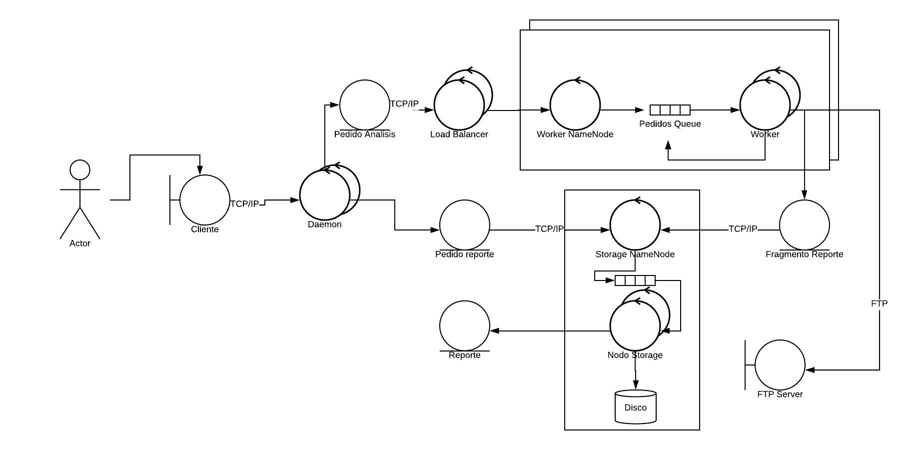
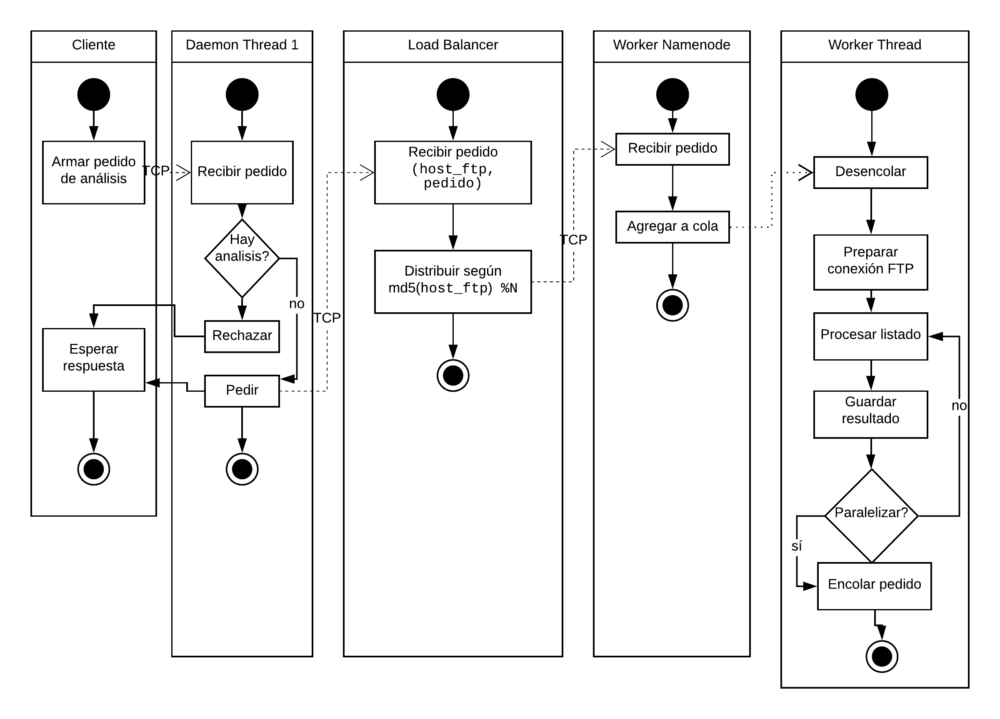
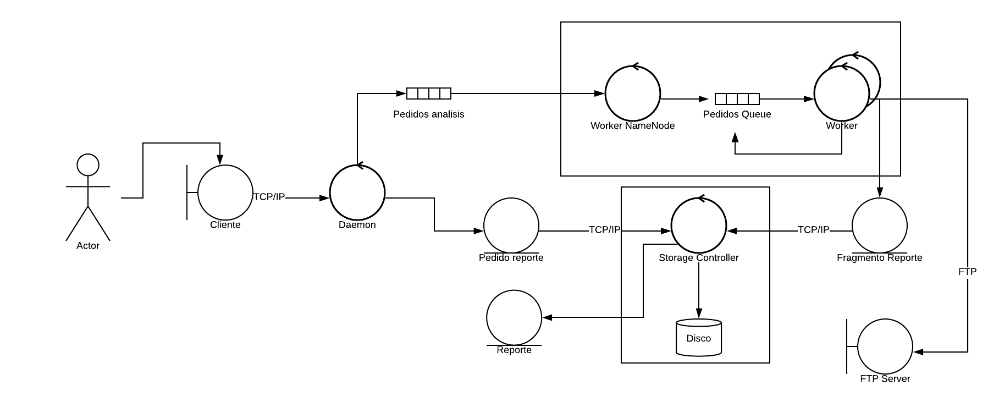
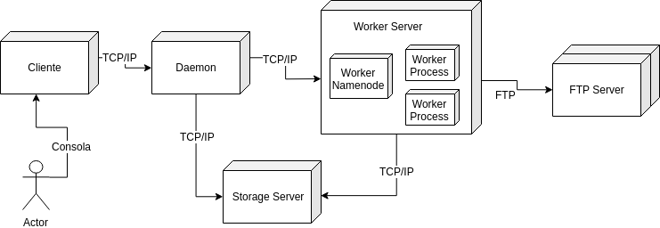
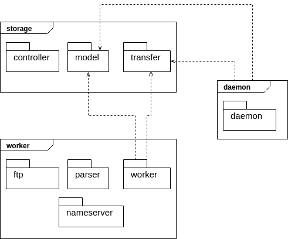

## Arquitectura general

Los puntos claves que debe resolver la propuesta de arquitectura son:

* debe haber un servicio corriendo todo el tiempo al cual se le pueda
consultar resultados y hacer nuevos pedidos
* escalabilidad de la arquitectura, en varios puntos:
    + manejos de muchas consultas de clientes al servicio
    + muchos análisis corriendo al mismo tiempo a servidores remotos
    + muchos datos a almacenar
* la utilización de varias computadoras para escalar debe ser
transparente y no debería requerir cambios en el código (ej. solo
por configuración)
* persistencia de los resultados
* debe proponer una solución *fair* que maneje el *trade-off* entre procesar pedidos nuevos y avanzar con los que ya están en proceso
* si bien se debe paralelizar el análisis del servidor FTP, no hay que
agotar los recursos del servidor (cantidad de conexiones y pedidos
simultáneos)

La propuesta de arquitectura se puede ver en la Figura 1. En principio,
paraleliza el servicio de consultas al cliente
(Daemon) con varios hilos, por lo que puede atender un buen volumen de consultas
tanto de análisis como de resultados. Por otro lado, se plantea un grupo
de procesadores que son paralelizables y puestos detrás de un *Load Balancer*.
La idea de éste último se puede ver en el diagrama de actividades
de la Figura 2: para dividir los pedidos entre varios de estos grupos
se puede usar una regla sencilla basada en la IP que se plantea analizar. Otras
formas de balanceo pueden basarse en latencia, cantidad de
*hops* o *throughput* de la red que conecta al grupo con el servidor FTP. Además
de este balanceo entre grupos, cada uno tiene varios hilos de procesamiento
que reciben pedidos a través de una cola.

Por otro lado, se desacopla totalmente el manejo de la estructura de datos,
ya que corresponde a otro grupo (o contenedor) que gestiona las complejidades
de actualización de la estructura (por su naturaleza recursiva) y la
persistencia de la misma. De la misma manera que el contenedor de procesadores,
existe un *name node* que toma los pedidos y los pone en una cola para
ser procesados. La cola puede ser la misma o puede ser particionada en varias
para permitir la distribución de los datos en varios sistemas de archivos
distintos.

Estas consideraciones en el diagrama de robustez resuelven la mayoría de los
puntos indicados al principio de la sección. Los restantes, sobre el *fairness*
de la solución y la disponibilidad de recursos de los servidores remotos.

En la Figura 2 se puede ver el diagrama de actividades del procesamiento del
pedido de un servidor. Los pasos son:

1. El cliente envía un pedido al demonio. Si hay un análisis existente (en procesamiento
o terminado), no se hace nada y se le responde al cliente. En caso contrario, se pide
un análisis nuevo.
2. El *load balancer* recibe un pedido y según su lógica de ruteo la distribuye a algún
servidor de *workers*.
3. El *worker namenode* recibe el pedido y lo agrega a la cola interna. La idea de esta
abstracción es que los hilos *worker* no tengan que preocuparse por las conexiones TCP.
4. El *worker thread* analiza un directorio que estaba pedido en la cola. Cuando obtiene
los resultados y los subdirectorios, se fija si se puede paralelizar. Hay tres escenarios
posibles: la positiva, la negativa por
superpoblación de pedidos de ese servidor y la negativa por la abundancia de conexiones
al servidor remoto. Por eso, también hay una cola interna que puede navegar el hilo
para aprovechar la conexión establecida. El balanceo es entonces entre la cantidad
de threads que procesan al mismo tiempo y la cantidad de cosas que hace cada thread
(anchura vs. profundidad). A nivel código luego veremos cómo se mantiene una invariante
entre pedidos y threads corriendo.

### Ventajas y desventajas de la propuesta

Podemos enumerar algunas desventajas sobre la propuesta:

* en principio, no reusar un pool de conexiones FTP implica un overhead
de login cada vez y que se desperdicie el recurso cuando se están procesando
los datos o esperando por I/O. Por ejemplo, mientras se envía la información
a la base de datos se podría ir ya pidiendo el listado de otro directorio.
* la pregunta de "se puede paralelizar" requiere cierta sincronización entre
los hilos. La solucion que propusimos, que si bien no anula la desventaja
la minimiza, es no hacer siempre la pregunta pero por nivel de directorio.
* si se arman muchos contenedores de trabajadores para manejar muchos
pedidos, se puede volver un cuello de botella la base de datos
sincronizada. Se podría pensar en un sistema de buffer local y que no sea
sincrónico el enviar a la base de datos con el seguir procesando.
* De la misma manera, si las consultas de resultados son muchas la
performance de procesamiento podría bajar. Para mejorar esto se podría
utilizar un caché.

Como ventajas, podemos marcar la relativa simplicidad de diseño y el
desacoplamiento entre los componentes. La escalabilidad está asegurada
por los mecanismos de comunicación entre los componentes.

## Vista de implementación

### Simplificaciones realizadas

En la Figura 3 se puede ver el diagrama de robustez de la implementación.
Se puede ver que es fundamentalmente la misma arquitectura en términos
de desacople y distribución de los componentes. Las diferencias son tres:
en principio, el demonio no es más un servidor multihilo. En segundo,
no hay un *load balancer*, porque sólo se usa un grupo de *workers*. Por
último, la base de datos se reduce a un proceso, sin tener una
paralelización. La estrategia para estas simplificaciones es seguir
demostrando el funcionamiento de varios patrones de arquitecturas
distribuídas pero sin complejizar demasiado la implementación. Por ejemplo,
la utilización de varios hilos para manejar los pedidos ya está visto en
los *workers*, y la idea del *namenode* del servidor de almacenamiento
es la misma que la del *worker*. Para el caso del *load balancer*, si
bien es un patrón interesante, su
funcionamiento como *middleware* es totalmente transparente y es
una lógica sencilla de implementar.

### Diagrama de despliegue

En la Figura 4 se puede ver el diagrama de *deployment* de la aplicación.
Esta misma se puede ver en el `docker-compose.yml`. Hay un contenedor
para el demonio, otro para *un* servidor de procesadores y otro para el
servidor de almacenamiento. Como agentes externos están los servidores FTP
y el cliente, que tienen sus propios contenedores. Para el caso de los servidores
externos armamos varias imágenes de manera de simular distintos tipos
de tareas.

### Detalles de implementación

Como se mencionó antes, es necesario definir un mecanismo justo
para no agotar los recursos de los servidores externos y a la vez
poder procesar pedidos nuevos. La solución implementada fue definir
una invariante respecto de la cantidad de pedidos en la cola y cantidad
de hilos que están procesando directorios de un mismo servidor. Esta
heurística para el *trade-off* profundidad vs. anchura es:

$$\mathrm{encolados}_s + \mathrm{threads}_s \leq N \ \ \ (\forall s \in \mathrm{Servidores})$$

Por ejemplo, si $N=4$, para un servidor puede haber 4 hilos
buscando directorios, o puede haber 2 hilos y 2 pedidos encolados, etc.
Esto limita la cantidad máxima de conexiones FTP efectivamente a 4, a la
vez que imposibilita llenar la cola de pedidos con directorios de ese
servidor. Una implementación más robusta podría
hacer que $N$ dependa del servidor (hay servidores que
aceptan más conexiones y redes que aceptan más *throughput*),
o podría usar una cola de prioridades
y permitir más encolamientos sin que vaya en detrimento
de los hilos.

Por otro lado, ya que se utiliza un Lock para poder ajustar
esas variables, al llegar a 0 se manda un mensaje a la base
de datos de que ha sido finalizado el análisis del servidor.
Esto no es realmente necesario, ya que la base de datos se puede
dar cuenta cuándo termina. Basta pensar en un algoritmo recursivo
que, al ser recibido un directorio hoja ($\Leftrightarrow$ no tiene
subdirectorios) lo marque como terminado, se llame al padre
para revisar si todos sus hijos están terminados y marcarlo en el caso
de que sí, y así recursivamente.

Nuevamente hay una heurística para cuándo persistir los análisis. Se
optó por persistir los análisis cada $1GB$ guardado, o cuando se
terminara el procesamiento. La persistencia se hace en un hilo separado
por lo que no se bloquea el atendimiento de los pedidos; cada
servidor se guarda en archivos separados y hay un lock en la persistencia
de cada servidor (no hay dos hilos que persistan a la vez el mismo servidor).

Finalmente, se podría pensar un lock más justo que balancee entre
lectura y escritura según el uso de los threads. Se utilizó
el `sync.Mutex` estándar de golang y es probable que no sea el más preciso
para este caso. Puede ser necesario perfilar un poco el procesamiento
para entender cuáles operaciones son las más comunes.

### Estructura del código

En la Figura 5 se puede ver un diagrama de paquetes del código. Se dividió
al programa en paquetes de `golang` intentando desacoplar los componentes
por medio de interfaces.

El paquete `storage` hace referencia a lo relacionado con la estructura
de datos, el almacenamiento y manejo de peticiones relacionadas a ello.
`model` contiene los tipos de datos necesarias para representar
a los directorios y archivos, `transfer` contiene los tipos y funciones
para poder comunicarse con el servidor. `controller` implementa la
funcionalidad necesaria para levantar un servidor de almacenamiento.

El paquete `worker` refiere a los procesadores del análisis. `ftp` se
encarga de armar conexiones FTP y mandar y recibir datos, `parser` procesa
la salida de comandos `ls`, `worker` representa el flujo de un hilo
procesador y `nameserver` el flujo de un gestor de hilos que recibe
peticiones y las despacha.

El `daemon` es bastante sencillo, puesto que solo requiere mandar pedidos
al *worker nameserver* y al *storage server*.

