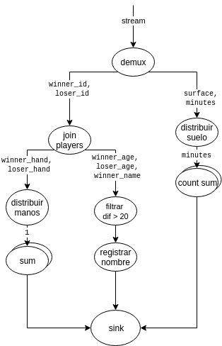
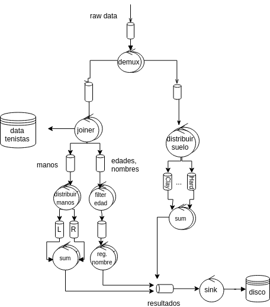
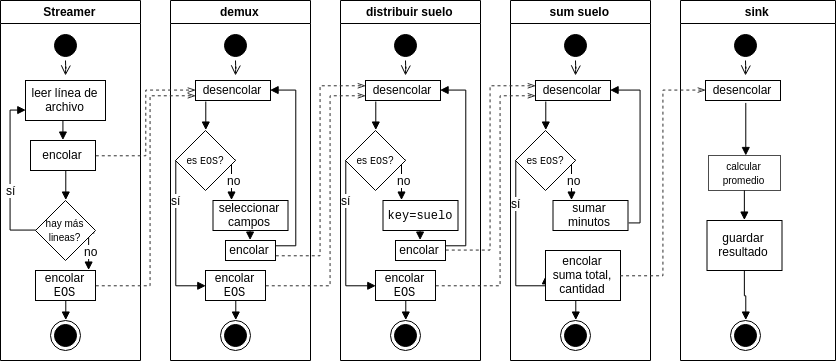
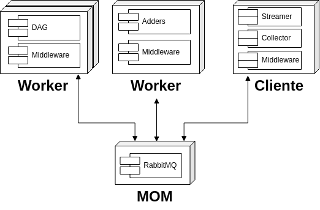
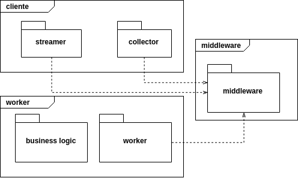

\ \ \

\ \ \

\ \ \

\ \ \

\ \ \

\ \ \

\ \ \

\ \ \

\ \ \

\ \ \

\ \ \

\ \ \

\ \ \

\ \ \

\ \ \

\ \ \

\ \ \

\ \ \

\ \ \

\ \ \

\ \ \

\ \ \

\ \ \

\ \ \

\ \ \

\ \ \

\ \ \

**Alumno**: Joaquín Torré Zaffaroni

**Padrón**: 98314

**Materia**: Sistemas Distribuidos I

**Cuatrimestre**: 2do 2019

**Docentes**: Pablo D. Roca, Ezequiel Torres Feyuk

\newpage

## Introducción

En el presente trabajo práctico se desarrolla una arquitectura distribuída
orientada a *streaming* utilizando *message-oriented middlewares*. El objetivo
de la arquitectura es realizar el cálculo de varias estadísticas para un
conjunto de datos de torneos de tenis.

El *pipeline* diseñado optimiza el manejo de los datos y la eficiencia de los
cálculos a través de unidades de cálculo ligadas al negocio. En este informe
detallamos las decisiones detrás del diseño, documentamos la implementación
y marcamos puntos de mejora.

## Vista lógica

En la Figura 1 podemos observar el flujo de los datos a lo largo del *pipeline*
en forma de grafo dirigido acíclico. En particular, modificamos la notación del
*DAG* para ilustrar cuándo hay un nodo multiplicado por distribución. Esto es,
se utilizan colas con claves de ruteo, y los nodos que las procesan son
equivalentes -- sólo se diferencian en que son instanciados para elegir de
una de esas colas. Enumeramos la función de cada nodo:

* `demux`. Toma el stream original, en formato de líneas CSV, y descarta campos
no utilizados. Se envía la información a la cola de `join players` con los
identificadores de jugadores, y se envían los minutos de la duración del partido
y el tipo de suelo a `distribuir suelo`.
* `distribuir suelo`. El tipo de superficie se utiliza como clave de ruteo para
mandar la información a un nodo especializado. Se le manda los minutos de juego.
* `count sum`. Recibe los minutos y los suma a su estado interno. Además cuenta la
cantidad de filas recibidas.
* `join players`. Con una base de datos interna, busca la información de
los jugadores según los identificadores provistos. Envía los campos de
mano hábil para cada jugador a `distribuir manos`; las edades de ambos y nombre
del ganador se envían a `filtrar`.
* `filtrar`. Filtra los datos que no cumplen la condición de tener un ganador
con 20 años más que el contrincante.
* `registrar nombre`. Proyecta el dato para quedarse sólo con el nombre.
* `distribuir nombres`. Según la mano del ganador se rutea el dato a vario
uno de los nodos sum. Como sólo queremos contar cuántos hay de cada uno, se
envía $1$.
* `sum`. Cada nodo suma los eventos de su clave de ruteo.
* `sink`. Obtiene los resultados de cada segmento del *pipeline* y lo imprime
a un archivo en disco.

En realidad, este caso de uso no es un *stream* verdadero. Se utiliza la
abstracción para procesar los datos de manera escalable, pero en definitiva
los datos son finitos y hay una condición de corte. En la sección de vista de
implementación veremos cómo maneja la arquitectura el fin de los datos.

## Vista de desarrollo

En la Figura 2 podemos ver una vista de diagrama de robustez de la arquitectura.
Como observación incial podemos notar que es en esencia el *DAG* pero en otro
lenguaje -- podemos ver los procesos. Como información nueva, es evidente
la utilización de las colas para comunicar los procesos. En particular,
en los casos de distribución usamos una cola según la clave de ruteo. La
publicación a las colas se hace a través de un *exchange*. También se ven los
datos extra que se utilizan para hacer la cruza de los datos con los jugadores.

Hay dos tipos de paralelizaciones en el diagrama. Algunos nodos, como `joiner`
o `filter edad`, pueden ser escalados horizontalmente sin problemas. Es
transparente utilizar una o mil instancias, por ejemplo. Sin embargo, para
el diseño de esta arquitectura contemplamos nodos que no se pueden paralelizar
más allá de lo estipulado. Es el caso de los nodos que siguen inmediatamente
a una operación de distribución; es decir, son los nodos que toman una clave de
ruteo para saber de dónde aceptar datos. Hay sólo un nodo por tipo de clave.

En el caso de RabbitMQ, todas las colas sin clave de ruteo son *working
queues* clásicas. Las que tienen clave de ruteo se componen por un *exchange*
seguido de varias *binded queues*.

## Vista de proceso

En la Figura 3 podemos ver un diagrama de actividades para el escenario de
calcular el promedio de minutos por tipo de suelo. La observación fundamental
de este diagrama es cómo se hace el manejo del fin del stream. El cliente que
inicia el envío de los datos al finalizar emite un token `EOS`(*end of stream*).
Este token se va manejando a lo largo del *pipeline* y reenviando. El caso
límite es el nodo anterior al *sink*. Ese nodo acumula resultados hasta
que recibe el `EOS`; cuando sucede esto, envía los resultados al *sink*.

El diagrama en la Figura 3 corresponde a la rama derecha de la Figura 2.
Simplificamos la vista para un solo tipo de suelo, pero es
evidente que habrá tantos nodos como superficies distintas haya. Por claridad
del diagrama no aclaramos sobre qué cola se opera; esta información ya está
disponible en la Figura 2.

Como vemos, el *sink* también hace un cálculo de promedio. Como en esta
arquitectura sólo definimos un nodo de `sum suelo` por tipo de superficie,
la cantidad de mensajes que recibe `sink` es constante sin importar el tamaño
de los datos. Por eso, consideramos razonable hacer esta operación en ese nodo.
De otra manera, si usáramos muchos nodos por cada tipo de superficie, sería
natural tener un nodo intermedio que paralelice la operación de calcular el
promedio por tipo de suelo.

## Vista física

En la Figura 4 se ve un diagrama de despliegue de la arquitectura. Observamos
una diferenciación entre un Worker que tiene nodos que no se pueden paralelizar
y un Worker que se puede paralelizar. El cliente inicia
el envío de los datos a través de una cola de RabbitMQ y junta los resultados
a través del *MOM*.

## Vista de implementación

En la Figura 5 se muestra la relación entre los paquetes de la implementación.
Enumeramos:

* `worker`: contiene los componentes asociados al trabajo
    + `business logic`: define las funciones puras relacionadas a las reglas
    del negocio
    + `worker`: instancia los nodos del *middleware* con las reglas de negocio,
    definiendo el DAG.
* `cliente`: contiene los componentes asociados a la entrada de datos y a
la recolección de resultados
    + `streamer`: convierte un archivo CSV a un *stream* para ser procesado,
    marcando con un `EOS` al final.
    + `collector`: escucha las colas de resultados y escribe los valores en disco.
* `middleware`: define los objetos de nodos y da una interfaz de comunicación
utilizando *queues*, *exchanges* y *bind queues*.

## Escenarios

Para este trabajo práctico hay tres escenarios.

1. Estadísticas de porcentaje de partidos ganados de zurdos contra diestros
y viceversa.
2. Registro de los nombres de los jugadores que han ganado partido a
contrincantes al menos veinte años más jovenes.
3. Estadísticas de duración en minutos de los partidos según el tipo de
superficie de la cancha de tenis.

Para los tres escenarios es necesario que el cliente levante un archivo a
ser *streameado* a los nodos procesadores.